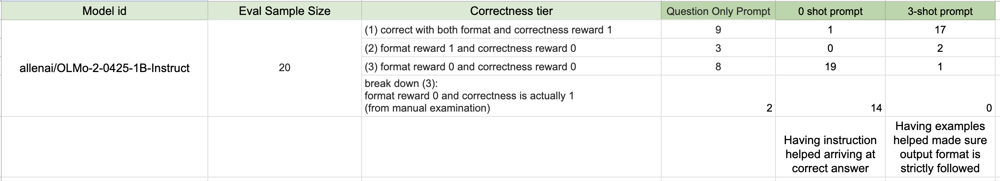

# Problem (prompting_baselines):  Run OLMo-2-0425-1B on GSM8K
## (a) Write a script to evaluate OLMo-2-0425-1B performance on GSM8K with zero-shot question_only, zero-shot r1_zero, and few-shot r1_zero_three_shot prompts.
Then, run your script and observe the outputs. For each prompt, how many model generations fall into each of the following categories: 
(1) correct with both format and correctness reward 1, 
(2) format reward 1 and correctness reward 0,
(3) format reward 0 and correctness reward 0? 

Observing at least ten examples of category 2, how many model outputs are actually correct but just not parsed properly What about category 3?  

Deliverable: A few sentences of commentary, the evaluation metrics, and a few examples of 
prompts and responses.  
Benchmark summary:   
 Model: allenai/OLMo-2-0425-1B-Instruct dataset: ./data/gsm8k/train.jsonl Evaluation sample size: 20  
 Average reward:  
    * Question-only prompting: 0.45, breakdown: {'both_correct': 9, 'only_format_correct': 3, 'neither_correct': 8}
    * Zero shot prompting: 0.05, breakdown: {'both_correct': 1, 'only_format_correct': 0, 'neither_correct': 19}
        note that 14 answers were actually correct but formatted wrong, hence no credit given.  
    * Few shot prompting(Sample=3): 0.85, breakdown: {'both_correct': 17, 'only_format_correct': 2, 'neither_correct': 1}

Having instruction helped with response math correctness, having examples is very helpful for format correctness and somewhat helpful for math correctness.  

## (b) Observing the model outputs, characterize the model’s behavior with each prompt. For example, if we want the model to answer the question, is it enough to just provide the question, or does the model exhibit other behaviors besides just answering the question? 
How do the zero-shot r1_zero and few-shot r1_zero_three_shot prompts shape the model’s behavior?

The model will always answer the question with 0-shot R1. It helps model get into the role we'd like it to play.  
The model can adhere to format better with the examples in 3-shot R1.  
